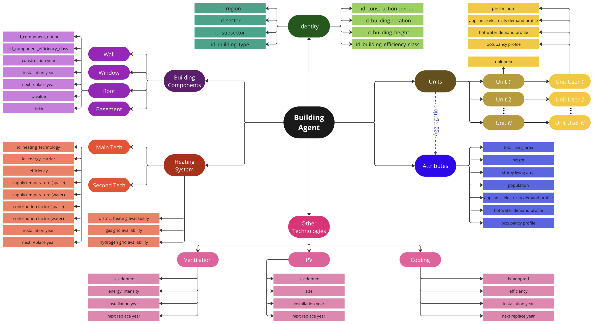
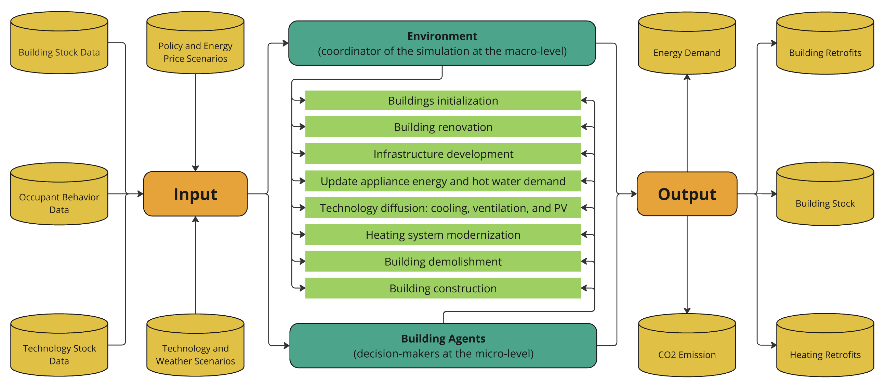

# RENDER Framework and Models

## RENDER Framework

`RENDER` is an agent-based ene**R**gy d**E**ma**N**d mo**D**eling fram**E**wo**R**k. 
It is designed to include energy end-users and decision-makers (e.g., households, industrial companies, vehicle owners) as agents. 
The technology change in the demand-side energy system is modeled at the micro-level as the decision-making processes of individual agents, then aggregated to the sector and regional level. 
Within the `RENDER` framework, the heterogeneity among agents, as well as their bounded-rationality and potential interactions, can be modeled flexibly. 
Policy instruments on efficiency regulations, technology bans, subsidy programs, etc. can also be considered in detail. 

Technically, `RENDER` benefits from two open-source packages:

- First is `Melodie`, which is an open-source general framework for agent-based modeling in Python ([repo](https://github.com/ABM4ALL/Melodie)). This package provides the main modules for developing agent-based models and is the backbone of `RENDER`.

- Second is `tab2dict`, which is a data management tool designed for developing scientific models ([repo](https://github.com/SongminYu/tab2dict)). The package converts formatted input dataframes (saved in `.xlsx` or `.csv` files) into Python dictionaries for efficient accessing. It also provides functions for collecting data in the simulation and produce output files. `tab2dict` was initially developed as an internal module of `RENDER` for dealing large input and output. Then, it was separated and published as an open-source package. 

By using `RENDER`, we aim to develop a series of agent-based energy demand models, among which the first one is `RENDER-Building` developed in the RokiG project in [Energiewendebauen](https://wissen-digital-ewb.de/en/) partially funded by the Federal Ministry of Economic Affairs and Climate Action (BMWK) of Germany under the [Energy Research Program](https://www.energieforschung.de/forschungsmissionen-fuer-die-energiewende/energieforschungsprogramm-des-bmwk). The other models developed with `RENDER` will be added in this repository in the future.

## RENDER-Building

### Model introduction

`RENDER-Building` is an agent-based model for the building sector in Germany to explore its decarbonization pathways across various scenarios. 
The whole German residential and non-residential building stock is represented by ~2M building agents configured in detail (see Figure 1). 

<figure style="text-align: center;">
  
  <figcaption>Figure 1: Data structure of building agents</figcaption>
</figure>

As shown, the building agents are initialized with a set of ids (identity). 
The ids themselves or their combinations link to the parameter values for the building agent, 
including physical components (wall, window, roof, basement), 
heating system and technologies, living/working units, and other technologies. 

After being initialized, the building agents will go through a series of processes (see Figure 2), 
where their bounded rationality is reflected in the modeling of their choices between renovation options or heating technologies based on the discrete-choice model.

<figure style="text-align: center;">
  
  <figcaption>Figure 2: Workflow of the RENDER-Building model</figcaption>
</figure>

Finally, the model produces the output including energy demand, CO2 emission, building stock, as well as the retrofitting actions happened in the simulation.
For more details, please refer to our working paper. 

### How to run RENDER-Building

The code of `RENDER` framework and the `RENDER-Building` model are saved in `models`. The data for running the model is saved separately saved for different projects. 
For example, for the project `PROJECT_NAME`, there is a folder `projects/PROJECT_NAME` containing the input data in `projects/PROJECT_NAME/input`. 
Next to the input folder, by running the `projects/PROJECT_NAME/main.py` file, the model is started and the output files will be created and saved in `projects/PROJECT_NAME/output`. 

## License

Copyright © 2024 Fraunhofer ISI 

The RENDER framework and the RENDER models are licensed under the Apache License, Version 2.0 (the "License"). 
You may not use the files in this repository except in compliance with the License. 
You may obtain a copy of the License in [LICENSE.md](LICENSE.md) or at http://www.apache.org/licenses/LICENSE-2.0.

Unless required by applicable law or agreed to in writing, software distributed under the License is distributed on an "AS IS" BASIS,
WITHOUT WARRANTIES OR CONDITIONS OF ANY KIND, either express or implied. See the License for the specific language governing permissions and limitations under the License.

[//]: # (In addition and per good scientific practice, you must cite the appropriate publications when you use RENDER in scientific work.)
